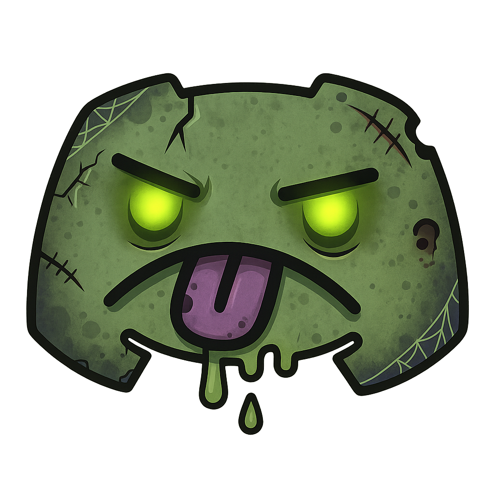

<p align="left">
  
</p>

## Bot Commands Usage

This document provides easy-to-follow instructions on how to use the available slash commands in the Bot.

> [!IMPORTANT]
> *Ensure the bot has the correct permissions and that `COMMAND_USERS` in `config` includes your user ID.*

---

### `/ping_server`

**Description:** Shows the bot's latency, server name, member count, and uptime.

**Usage:**

```
/ping_server
```

---

### `/ping_client`

**Description:** Measures client latency, round‑trip time, and client uptime.

**Usage:**

```
/ping_client
```

---

### `/block_add <keyword>`

**Description:** Toggles a keyword in the block list. Messages with blocked keywords will be dropped.

**Usage:**

```
/block_add spoiler
```

---

### `/block_list`

**Description:** Lists all currently blocked keywords.

**Usage:**

```
/block_list
```

---

### `/announcement_trigger_add <guild_id> <keyword> <user_id> [channel_id]`

**Description:**  
Registers a trigger so that when a message in the given guild matches the keyword (and optional filters), it will announce to subscribers.

**Parameters:**
- `guild_id`: Discord server ID (`0 = all guilds`)  
- `keyword`: Word to match  
- `user_id`: Discord user ID (`0 = any user`)  
- `channel_id`: Channel ID to listen in (`0 = any channel`, omit for any)

**Usage Examples:**
```
/announcement_trigger_add guild_id:0 keyword:lol user_id:0
/announcement_trigger_add guild_id:123456789012345678 keyword:trade user_id:111111111111111111
/announcement_trigger_add guild_id:123456789012345678 keyword:raid user_id:0 channel_id:987654321098765432
```

---

### `/announce_trigger_list [delete:<n>]`

**Description:**  
Lists all current announcement triggers across every guild, or deletes one by its index.

**Parameters:**
- `delete`: The 1-based index of the trigger to remove

**Usage Examples:**
```
/announce_trigger_list
/announce_trigger_list delete:2
```

---

### `/announce_subscription_toggle <guild_id> [@user] [keyword]`

**Description:**  
Subscribes or unsubscribes a user to announcements for a keyword — or for all keywords.

**Parameters:**
- `guild_id`: Discord server ID (`0 = all guilds`)  
- `@user` (optional): The Discord user to toggle (defaults to yourself)  
- `keyword` (optional): The keyword to subscribe to (`* = all keywords`)  

**Usage Examples:**
```
/announce_subscription_toggle guild_id:0 keyword:lol
/announce_subscription_toggle guild_id:123456789012345678
/announce_subscription_toggle guild_id:123456789012345678 keyword:* user:@Mac
/announce_subscription_toggle guild_id:123456789012345678 keyword:trade user:@Mac
```

---

### `/announce_subscription_list [delete:<n>]`

**Description:**  
Lists all announcement subscriptions across every guild, or deletes one by its index.

**Parameters:**
- `delete`: The 1-based index of the subscription to remove

**Usage Examples:**
```
/announce_subscription_list
/announce_subscription_list delete:7
```

---

### `/announce_help`

**Description:**  
Shows a formatted help embed that explains how to use all the announcement commands.

---

### `/onjoin_dm <server_id>`

**Description:** Toggles DM notifications when someone joins the specified server. (Only works for servers with 1k or less members)
If enabled, you’ll receive a direct message with the new member’s details whenever someone joins that guild.
> **Note:** Your account connected to Copycord must be a member of the server to detect when someone joins the server.

**Parameters:**
* `server_id` (required): The Discord server (guild) ID you want to watch.

**Usage Example:**


```
/onjoin_dm 123456789012345678
```

### `/onjoin_role <role>`
**Description:** Toggle an on-join role for the current server. Run once to add the role; run again with the same role to remove it.

**Options:**
- `role` *(required, role)* — The role to add or remove from the on-join list.

**Usage Example:**
```
/onjoin_role @Member
```

**Notes:**
- Multiple on-join roles are supported (run the command once per role).
- Managed roles or roles above the bot’s top role cannot be assigned.
- The bot must have **Manage Roles** permission.

---

### `/onjoin_roles [clear]`
**Description:** List all configured on-join roles for the current server, or clear them all.

**Options:**
- `clear` *(optional, boolean, default: false)* — If `true`, removes **all** on-join roles for this server.

**Usage Example:**
```
/onjoin_roles clear:true
```

**Notes:**
- If `clear:false` (default), the command lists current on-join roles.
- Missing or deleted roles are shown as “missing” in the list.


---

### `/onjoin_sync [include_bots] [dry_run]`
**Description:** Scan all server members and add any **missing** on-join roles.

**Options:**
- `include_bots` *(optional, boolean, default: false)* — If `true`, bots are included in the sync.
- `dry_run` *(optional, boolean, default: false)* — If `true`, shows what would change without modifying roles.

**Usage Example:**
```
/onjoin_sync include_bots:true dry_run:true
```

---
### `/purge_assets <type> <confirm> [unmapped_only] [cloned_only]`
**Description:** Purge emojis, stickers, or roles from the current guild.

**Type Options:**
- `emojis`
- `stickers`
- `roles`

**Modes:**
- `unmapped_only = true` — Only delete assets **not** mapped in the DB.
- `cloned_only = true` — Only delete assets that **are mapped** (i.e., cloned assets).
> These two options are **mutually exclusive**.

**Usage Examples:**
```text
/purge_assets roles confirm
/purge_assets emojis confirm unmapped_only:true
/purge_assets stickers confirm cloned_only:true

> **Note:** Make sure the copycord role is positioned at the top to remove roles.

---

### `/role_block <role> <roleid>`
**Description:** Block a role from being added during sync.

**Usage Example:**
```
/role_block @member 12345678987654321
```

---
### `/role_block_clear`
**Description:** Clear all blocked roles.

**Usage Example:**
```
/role_block_clear
```

---

### `/export_dms <user_id> [webhook_url] [json_file]`
**Description:** Export a user’s DM history to a JSON file. Optionally forwards each message to a specified webhook.

**Options:**
- `user_id` *(required, string)* — The target user’s Discord ID to export DMs from.
- `webhook_url` *(optional, string, default: empty)* — If provided, messages are forwarded in real time to this webhook. If omitted or empty, forwarding is disabled.
- `json_file` *(optional, boolean, default: true)* — Whether to save a JSON snapshot of the DM export.

**Usage Example:**
```
/export_dms 123456789012345678 https://discord.com/api/webhooks/123/abc true
```

**Notes:**
- Only one DM export per user can run at a time.

---
### `/pull_assets <asset> [guild_id]`
**Description:** Export server **emojis** and/or **stickers** into a compressed folder.

**Options:**
- `asset` *(required, string; choices: `both`, `emojis`, `stickers`; default: `both`)* — Which assets to export.
- `guild_id` *(optional, string)* — Target server’s Discord ID. If omitted, the host guild is used.

**Usage Example:**
```
/pull_assets both
/pull_assets emojis
/pull_assets stickers 159962941502783488
```

**Notes:**
- The resulting archive is saved under: `/data/assets`.
- Inside the archive, assets are organized as:
---

### Role mention pings (`/role_mention`)

Configure roles that get auto-mentioned at the top of cloned messages, per **clone** and optionally per **cloned channel**.

#### `/role_mention add <role> [channel_id]`
**Description:** Add a role to be mentioned on cloned messages.

- `role` — The role in the **cloned guild** to mention.
- `channel_id` — (Optional) **Cloned channel ID** to scope the ping.  
  Leave empty to apply to **all channels** in this clone.

**Examples:**
```text
/role_mention add @Alerts
/role_mention add @RaidPing channel_id:123456789012345678
```

---

#### `/role_mention remove <role> [channel_id]`
**Description:** Remove an existing role mention configuration.

- If `channel_id` is empty, removes the **global** config for that role in this clone.
- If `channel_id` is set, removes only that **channel-scoped** config.

**Examples:**
```text
/role_mention remove @Alerts
/role_mention remove @RaidPing channel_id:123456789012345678
```

---

#### `/role_mention list`
**Description:** List all role mention configurations for the **current clone**.

Shows each role and whether it applies to **all channels** or a specific cloned channel.

**Example:**
```text
/role_mention list
```

---

## Channel webhook identity (`/channel_webhook`)

Customize the webhook **name** and **avatar** Copycord uses when cloning messages, either per-channel or for all cloned channels.

### `/channel_webhook set <channel> <webhook_name> [webhook_avatar_url]`
**Description:** Set a custom webhook identity for one cloned channel.

- `channel` — The **cloned** text channel to customize.
- `webhook_name` — Name shown on all cloned messages in this channel.
- `webhook_avatar_url` — (Optional) Image URL used as avatar.

**Examples:**
```text
/channel_webhook set #cloned-chat "Copycord Relay"
/channel_webhook set #cloned-chat "Copycord Relay" webhook_avatar_url:https://example.com/avatar.png
```

---

### `/channel_webhook view <channel>`
**Description:** View the custom webhook profile for a channel.

Shows the current webhook name and avatar (if set) for that cloned channel.

**Example:**
```text
/channel_webhook view #cloned-chat
```

---

### `/channel_webhook clear <channel>`
**Description:** Remove the custom webhook profile from a channel.

After clearing, cloned messages in that channel use the original author’s name and avatar again.

**Example:**
```text
/channel_webhook clear #cloned-chat
```

---

### `/channel_webhook list`
**Description:** List all channels in this clone that have custom webhook profiles.

Shows each channel, its webhook name, and whether a custom avatar is set.

**Example:**
```text
/channel_webhook list
```

---

### `/channel_webhook set_all <webhook_name> <confirm> [webhook_avatar_url] [overwrite_existing]`
**Description:** Apply a webhook name/avatar to **all cloned channels** in this server.

- `webhook_name` — Name used on cloned messages in all cloned channels.
- `confirm` — Must be `confirm` to run.
- `webhook_avatar_url` — (Optional) Avatar URL applied to all channels.
- `overwrite_existing` — If `true`, replaces any existing per-channel profiles.

**Examples:**
```text
/channel_webhook set_all "Copycord Relay" confirm
/channel_webhook set_all "Copycord Relay" confirm webhook_avatar_url:https://example.com/avatar.png overwrite_existing:true
```

---

### `/channel_webhook clear_all <confirm>`
**Description:** Clear **all** channel webhook profiles in this clone.

- `confirm` — Must be `confirm` to proceed.

After running, all cloned messages revert to using the original author’s name and avatar.

**Example:**
```text
/channel_webhook clear_all confirm
```

---
